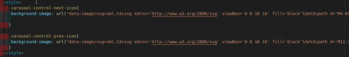
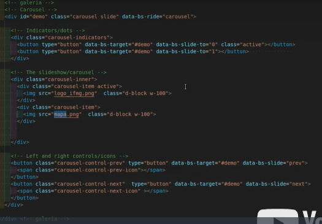

# Curso-IFMG
#*Carrossel de imagens

|style|web|
|-|-|
||.|

O Observer, possui duas entidades principais: 
 |Entidade 1|Entidade 2|
 |-||-|
 |Ele permite que objetos se "inscrevam" par receber notificações quando outro objeto sofre uma mudança. Deste modo, os objetos podem sempre se manter atualizados quando houver alguma mudança.|
